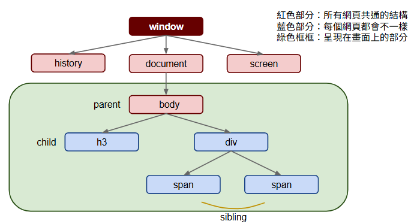

# JavaScript 教學 - HTML DOM

參考：

範例：
* [07.html](../demo/07.html)
* [07.js](../demo/07.js)
* [08.html](../demo/08.html)
* [08.js](../demo/08.js)


全名 HTML Document Object Model。

將 Javascript 程式與畫面結合的關鍵概念。

---

## HTML DOM 簡介
* https://developer.mozilla.org/en-US/docs/Web/API/Document_Object_Model
* 每一份網頁包含許多 HTML 標籤，瀏覽器在讀取網頁時，會將這些標籤轉化成一種程式可使用的物件樹狀結構，即 HTML DOM。
* 樹狀結構與 HTML 標籤的階層結構對應。
    ```html
    <html>
        <body>
            <h3>HTML DOM</h3>
            <div>
                <span>階層結構</span>
                <span>樹狀結構</span>
            </div>
        </body>
    </html>
    ```
    ```scss
    window
    ├── document             // 操作 HTML DOM
    │   ├── body
    │   │   ├─ h3  
    │   │   └─ div
    │   │      ├─ span  
    │   │      └─ span
    │   ├── head
    │   ├── getElementById()
    │   └── ...
    │
    ├── location             // 網址列相關資訊
    │   ├── href
    │   ├── hostname
    │   ├── pathname
    │   └── ...
    │
    ├── navigator            // 瀏覽器、裝置相關資訊
    │   ├── userAgent
    │   ├── language
    │   └── ...
    │
    ├── screen               // 使用者螢幕資訊
    │   ├── width
    │   ├── height
    │   └── ...
    │
    ├── history              // 瀏覽紀錄操作
    │   ├── back()
    │   ├── forward()
    │   └── ...
    │
    ├── console              // 開發者工具的控制台
    │   ├── log()
    │   ├── error()
    │   └── ...
    ├── localStorage
    ├── sesstionStorage
    ├── alert()
    ├── confirm()
    ├── prompt()
    └── ...
    ```
    

### window 物件
此物件是 HTML DOM 中的最上層物件，在程式中隨時寫 window 即可取得。

相關連結
* [MDN | HTML DOM API](https://developer.mozilla.org/zh-CN/docs/Web/API)
* [MDN | Window](https://developer.mozilla.org/en-US/docs/Web/API/Window)

| 類型 | 屬性 / 方法                                         | 說明                         | 範例                                      |
| -- | ----------------------------------------------- | -------------------------- | --------------------------------------- |
| 物件 | `window`                                        | 瀏覽器的全域物件，代表瀏覽器的視窗本身        | `window`                                |
| 方法 | `window.alert("文字")`                            | 顯示警告視窗 (可省略 `window.`)      | `alert("Hello")`                        |
| 方法 | `window.prompt("訊息", "預設值")`                    | 顯示輸入視窗，讓使用者輸入資料            | `prompt("Enter a number", "")`          |
| 方法 | `window.confirm("訊息")`                          | 顯示確認視窗，回傳 `true` 或 `false` | `confirm("Are you sure?")`              |
| 方法 | `window.open("網址")`                             | 開啟新視窗或分頁                   | `window.open("http://www.google.com/")` |

* 補充：
    * `alert`, `prompt`, `confirm` 其實都是 `window` 下的方法，在瀏覽器中可直接使用，會自動引用 `window`。所以 `alert("Hi")` 等同於 `window.alert("Hi")`。

### document 物件
document 物件是 window 物件的一個屬性，此物件包含許多重要的成員。

| 類型 | 屬性 / 方法                         | 說明                                     | 範例                                         |
| -- | ------------------------------- | -------------------------------------- | ------------------------------------------ |
| 屬性 | `window.document`               | 表示目前網頁的文件物件，為 DOM 的根節點                 | `window.document`                          |
| 屬性 | `document`                      | `window.document` 的簡寫，瀏覽器中可省略 `window` | `document`                                 |
| 方法 | `document.getElementById("id")` | 取得指定 `id` 的 DOM 元素                     | `document.getElementById("title")`         |

* 補充：
    * `document` 是 `window` 物件下的一個屬性，因此 `window.document` 和 `document` 效果相同。
    * `document.location` 實際上是 `window.location` 的別名，也可使用 `window.location.href`。

### screen 物件
screen 物件是 window 物件的一個屬性，此物件包含使用者螢幕的資訊。

| 類型 | 屬性 / 方法                | 說明               | 範例                                 |
| -- | ---------------------- | ---------------- | ---------------------------------- |
| 屬性 | `window.screen`        | 表示螢幕 (顯示器)相關資訊的物件 | `window.screen`                    |
| 屬性 | `window.screen.width`  | 取得螢幕的寬度 (單位：像素)   | `window.screen.width` → 例如 `1920`  |
| 屬性 | `window.screen.height` | 取得螢幕的高度 (單位：像素)   | `window.screen.height` → 例如 `1080` |

* 補充：
    * `screen.width` 和 `screen.height` 可用來偵測使用者的螢幕解析度。
    * `window` 前綴可省略，直接寫 `screen.width` 也可以。

## 程式操作畫面的步驟
* 從 HTML DOM 中取得標籤物件，例如 div 標籤物件、a 標籤物件。
* 更改標籤物件中的成員資料。
* 不同的成員資料對應到不同的 HTML/CSS。

### 取得標籤物件
```html
<div id="title" class="bold">Hello World</div>
<script type="text/javascript">
    // 取得標籤物件
	var divObject=document.getElementById("title");

    // 標籤物件的成員
    console.log(divObject.innerHTML);  // 標籤的內文
	console.log(divObject.id); // 標籤的 id 屬性設定
	console.log(divObject.className);  // 標籤的 class 屬性設定
    divObject.innerHTML="Changed World"; // 網頁畫面立即更新為 Changed World

    // 標籤物件的 style 屬性
    console.log(divObject.style.color);
    console.log(divObject.style.padding);
    console.log(divObject.style.fontSize);
    console.log(divObject.style.borderStyle);
    // ...
</script>
```
* HTML 語法中的 `<div>....</div>` 會被自動處理成 div 物件，我們再透過程式取出此物件以利未來使用。
* 每個標籤物件都內建數十個屬性和方法，其中許多成員與 HTML 的概念直接對應。
* 每個標籤物件都有 style 屬性。此屬性底下存放了所有在此標籤上的 CSS 設定。
    | CSS 中的屬性 | Javascript 物件中的對應 |
    | ----------- | ---------------------- |
    | color       | obj.style.color        |
    | padding     | obj.style.padding      |
    | font-size   | obj.style.fontSize     |
    | border-style| obj.style.borderStyle  |

### 修改標籤物件
```html
<div id="title" class="bold">Hello World</div>
<script type="text/javascript">
	var divObject=document.getElementById("title");

    console.log(divObject.innerHTML);
    divObject.innerHTML="Changed World"; // 網頁畫面立即更新為 Changed World
    console.log(divObject.innerHTML);
</script>
```

### 新增標籤物件
```html
<div id="title" class="bold">Hello World</div>
<script type="text/javascript">
	var obj=document.createElement("div");

    // 利用 createElement 方法建立新的標籤物件
    obj.innerHTML="這是新增 div 標籤物件";

    // 利用 appendChild 將物件加入其他標籤物件的內部，此時，我們稱 div 標籤是 body 標籤的孩子。
    document.body.appendChild(obj);
</script>
```

### 刪除標籤物件
```html
<div id="title" class="bold">Hello World</div>
<div class="remove">準備<span>"刪除"</span>的標籤物件</div>
<script type="text/javascript">
    // 先取得刪除目標
	var obj=document.getElementsByClassName("remove");

    // 使用 class 取得目標，會回傳陣列
    obj[0].remove();

    // 舊版瀏覽器
    // obj[0].parentNode.removeChild(obj);
</script>
```

## 事件處理
* 針對有興趣的事件，撰寫對應的函式。
* 將寫好的函式註冊給該事件，成為事件處理函式。
* 當事件發生時，系統將主動呼叫已註冊的事件處理函式。
* 事件分類：
    * 滑鼠事件
    * 鍵盤事件
    * 載入事件 (如 `load`, `DOMContentLoaded`)
    * 媒體事件 (如 `play`, `pause`, `ended`)
    * 表單事件 (如 `submit`, `change`, `input`)

### 使用者觸發的事件
透過使用者的操作所引發的事件。

| 事件名稱        | 說明   | 適用於                |
| ----------- | ---- | ------------------ |
| `click`     | 單擊   | 滑鼠點擊一次元素時觸發        |
| `dblclick`  | 雙擊   | 滑鼠快速點擊兩次時觸發        |
| `mousedown` | 滑鼠按下 | 滑鼠按鈕被按下時觸發         |
| `mouseup`   | 滑鼠放開 | 滑鼠按鈕釋放時觸發          |
| `mousemove` | 滑鼠移動 | 滑鼠在元素上移動時觸發        |
| `keydown`   | 按下鍵盤 | 鍵盤任一鍵被按下時觸發        |
| `keyup`     | 放開鍵盤 | 鍵盤按鍵釋放時觸發          |
| `keypress`  | 敲打鍵盤 | 鍵盤輸入時觸發 (已淘汰，不建議使用) |

#### 入門：
在 HTML 標籤中直接加入事件註冊用的屬性，通常將事件名稱前面加 on 即是。

範例：
```html
<div onclick="alert('事件發生');">點擊此區塊</div>
<div onmouseover="this.style.color='red';">滑鼠移進此區塊時，文字變紅色</div>
```

#### 進階：
進階的事件處理，直接使用程式碼為之。

範例：
```html
<div id="box">這是處理的目標</div>
<script type="text/javascript">
	// 此函式用來擔任事件處理函式
	function handler() {
        alert("事件發生");
    }

	// 將函式註冊為 div 標籤 click 事件的處理函式
	var box = document.getElementById("box");
    // 可以綁定多個處理函式
	box.addEventListener("click", handler);
    // 同樣可行，但會覆蓋前一個函式
    box.onclick=handler; 
</script>
```

#### 事件物件簡介 (Event Object)
* 事件發生後，系統會收集與事件相關的資訊，例如滑鼠座標位置、鍵盤按鍵代碼等等。
* 資訊被綜合製作為一個事件物件，取得此物件，即可取得其他重要資訊。

範例：
```html
<div id="box">這是處理的目標</div>
<script type="text/javascript">
    // 事件處理函式的第一個參數，取得系統產生的事件物件
	function handler(e) {
        alert(e.clientX+","+e.clientY);
    }
	// 將函式註冊為 div 標籤 click 事件的處理函式
	var box=document.getElementById("box");
	box.addEventListener("click", handler);
</script>
```

事件物件的常用屬性：
| 屬性名稱      | 說明                            | 範例                         |
| --------- | ----------------------------- | -------------------------- |
| `clientX` | 事件發生時，滑鼠相對於**可視區域左邊緣**的 X 座標  | `event.clientX` → 例如 `150` |
| `clientY` | 事件發生時，滑鼠相對於**可視區域上方邊緣**的 Y 座標 | `event.clientY` → 例如 `300` |
| `key`  | 傳回實際被按下的字元 (如 `"a"`、`"Enter"`) | `event.key === "Enter"` |
| `code` | 傳回實際鍵盤上的鍵位代碼 (如 `"KeyA"`)      | `event.code === "KeyA"` |


### 系統觸發的事件
在網頁運作的過程中系統主動產生的事件。

| 事件名稱    | 說明                   | 適用於                       |
| ------- | -------------------- | ------------------------- |
| `load`  | 當某個資源 (如圖片、網頁)載入完成時觸發 | 圖片、iframe、整個頁面等           |
| `ended` | 影音播放完畢時觸發            | `<audio>`、`<video>` 等媒體元素 |

load 可用於：
```javascript
window.addEventListener("load", function () {
  console.log("頁面載入完成");
});
```
ended 典型用法如下：
```javascript
const video = document.getElementById("myVideo");
video.addEventListener("ended", function () {
  alert("影片播放完畢！");
});
```

